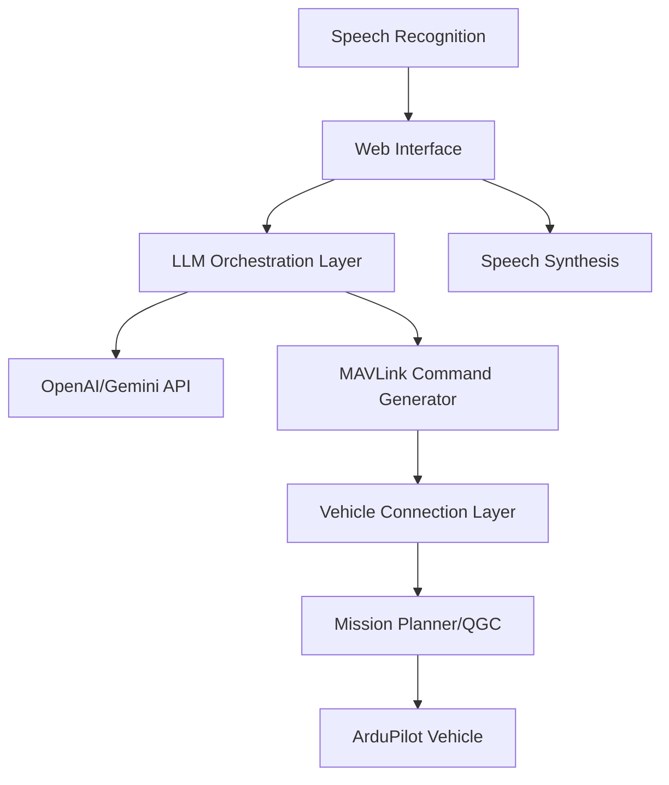

# ArduPilot AI Assistant

A Next.js application that enables natural language control of ArduPilot vehicles through text and voice commands.

## System Architecture




## Features

- 💬 Natural language processing for drone control
- 🎤 Voice command recognition and processing
- 🚁 Real-time vehicle status monitoring
- 🗺️ Interactive flight path visualization
- 🔄 Simulated MAVLink interface (can be replaced with real connection)
- 🧠 Google Gemini API integration for command interpretation
- 🔒 Safety validation for potentially dangerous commands


## Technologies Used

- **Next.js** - React framework for the frontend
- **TypeScript** - For type safety and better developer experience
- **Tailwind CSS** - For styling
- **shadcn/ui** - Component library
- **Google Gemini API** - For natural language processing
- **Web Speech API** - For voice recognition
- **Zustand** - For state management


## Installation


### Setup Instructions

1. Clone the repository:


```shellscript
git clone https://github.com/craftydivy/ArduPilot-AI-Assistant.git
cd ArduPilot-Assistant
```

2. Install dependencies:


```shellscript
npm install
# or
pnpm install
```

3. Add the Gemini API Key in .env.local:


```plaintext
NEXT_PUBLIC_GEMINI_API_KEY=your-actual-gemini-api-key
```

5. Start the development server:


```shellscript
npm run dev
# or
yarn dev
# or
pnpm dev
```

6. Open [http://localhost:3000](http://localhost:3000) in your browser to see the application.


## Usage

### Text Commands

Type commands in the chat input and press Enter or click the Send button. Example commands:

- "Take off to 50 meters"
- "Fly north 100 meters"
- "Return to home"
- "What's my current status?"
- "Change mode to loiter"
- "Land now"


### Voice Commands

1. Click the microphone button to start voice recognition
2. Speak your command clearly
3. The system will automatically process your command when you finish speaking
4. You can also click the stop button to manually end recording


## Connecting to a Real Drone

This prototype uses a simulated MAVLink interface. To connect to a real drone:

1. Replace the simulated MAVLink interface in `lib/mavlink-interface.ts` with a real WebSocket connection to Mission Planner or QGroundControl.
2. Implement proper error handling and connection management for real-world usage.
3. Add additional safety checks for commands that could potentially be dangerous.


## Development

### Adding New Commands

To add support for new commands:

1. Update the `simulateGeminiResponse` function in `lib/gemini-service.ts` to recognize and process the new command patterns.
2. Add appropriate action types and parameters to the `AIAction` type.
3. Implement the command execution in the `handleSendMessage` function in `components/chat.tsx`.


## Contact

For questions or feedback, please reach out to:

